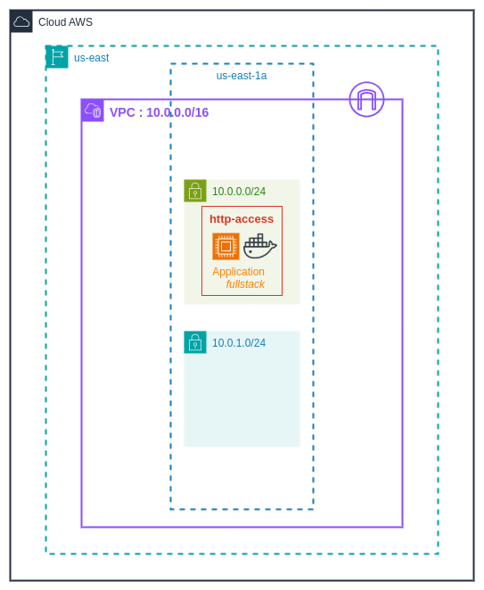
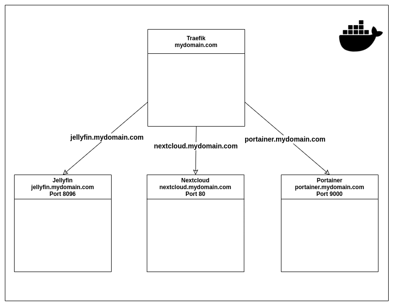

+++
title = 'Laboratoire'
draft = false
weight = "400"
+++

Dans ce laboratoire, nous allons implémenter trois services ainsi qu'un reverse proxy avec Docker, puis implémenter le chiffrement SSL/TLS pour avoir une communication HTTPS vers les services déployés. Les services vont être déployés sur une machine EC2 (AWS)

### Services
Voici la liste des services que nous allons déployer :

+ [Portainer](https://www.portainer.io/) : Un service permettant d'avoir un tableau de bors centralisé pour *monitorer* notre infrastructure *Docker*.

+ [Jellyfin](https://jellyfin.org/) : Un *media server* (similaire à *Plex*), permettant d'avoir une bibliothèque pour vos films, musique et séries.

+ [Nextcloud](https://fr.wikipedia.org/wiki/Nextcloud) : Logiciel libre de site d'hébergement de fichiers et une plateforme de travail collaboratif (de type *OneDrive* et *Office365*). 

+ [Traefik](https://traefik.io/traefik/) : Un *reverse proxy* facile à implémenter.

### Infrastructure
L'infrastructure finale est la suivante :


L'infrastructure Docker est la suivante : 



### Étape 1 - Déploiement d'une machine EC2
Déployez une instance EC2 avec les spécificité suivantes : 
+ AMI : Ubuntu 24.04 LTS
+ Groupe de sécurité : Autorise HTTP, HTTPS, SSH et tous les ports TCP.
+ Espace : 64GB

### Étape 2 - Déploiement des services

Maintenant que notre VM EC2 est déployé, nous pouvons commencer à la configurer.  

#### 1- Connexion
Connectez-vous par SSH à votre instance EC2 en utilisant votre éditeur préféré. 

#### 2- Installation de Docker
Installez Docker en utilisant le script donné sur le [site de la documentation de Docker](https://docs.docker.com/engine/install/ubuntu/) : 
```bash
# Add Docker's official GPG key:
sudo apt-get update
sudo apt-get install ca-certificates curl
sudo install -m 0755 -d /etc/apt/keyrings
sudo curl -fsSL https://download.docker.com/linux/ubuntu/gpg -o /etc/apt/keyrings/docker.asc
sudo chmod a+r /etc/apt/keyrings/docker.asc

# Add the repository to Apt sources:
echo \
  "deb [arch=$(dpkg --print-architecture) signed-by=/etc/apt/keyrings/docker.asc] https://download.docker.com/linux/ubuntu \
  $(. /etc/os-release && echo "${UBUNTU_CODENAME:-$VERSION_CODENAME}") stable" | \
  sudo tee /etc/apt/sources.list.d/docker.list > /dev/null
sudo apt-get update
```
```bash

sudo apt-get install docker-ce docker-ce-cli containerd.io docker-buildx-plugin docker-compose-plugin
```

#### 3- Déploiement de *Portainer*
Nous allons déployer un service à la fois. Commençons par *Portainer*.

Créez le fichier `compose.yml` suivant : 

```yaml
services:
  portainer:
    # Image de portainer officielle (ce=community edition, alpine=légère) 
    image: portainer/portainer-ce:alpine
    # Nom donné au conteneur 
    container_name: portainer
    # Dans le cas où le conteneur s'arrête/crash, il est automatiquement relancé 
    restart: unless-stopped
    # Réseau docker dans lequel le conteneur va s'exécuter
    networks: 
        - cloud
    # Mappage de port (du port 9000 du conteneur vers le port 9000 de la machine hôte)
    ports:
      - 9000:9000
    # Volumes 
    volumes:
      - /var/run/docker.sock:/var/run/docker.sock
      - portainer_data:/data
# Définition des volumes des conteneurs (portainer et bd)
volumes:
    portainer_data:
# Création du réseau cloud (ou les conteneurs vont être lancés)
networks:
    cloud:
        driver: bridge
```

Dans le répertoire du fichier `compose.yml`, lancez la commande suivante :
```bash
sudo docker compose up -d
```

Dans la configuration ci-dessus, le port `9000` du conteneur (port sur lequel *Portainer* écoute par défaut) est mappé sur le port `9000` de notre machine.

Dans un navigateur, allez sur `<adresse IP de l'instance EC2>:9000`

Vous serez en mesure d'accéder à la page d'accueil de *Portainer*. 

Créez un compte administrateur, puis commencez à explorer les différentes fonctionnalités qu'offre ce service.

#### 4- Déploiement de Nextcloud
Maintenant, ajoutons un nouveau service à notre stack : *Nextcloud*

Dans le fichier `compose.yml` créé précédemment, ajoutez les définition suivantes dans la section `services` :

```yaml
  nextclouddb:
    # Image mariadb officielle pour entreposer les données de nextcloud
    image: mariadb
    # Nom donné au conteneur 
    container_name: nextcloud-db 
    # Dans le cas où le conteneur s'arrête/crash, il est automatiquement relancé 
    restart: unless-stopped 
    command: --transaction-isolation=READ-COMMITTED --binlog-format=ROW
    # Réseau dans lequel le conteneur va s'exécuter (dans le même réseau que nextcloud)
    networks: 
      - cloud
    # Volumes du conteneur: mappe un répertoire du conteneur vers un volume docker pour faire persister les données
    volumes:
      - nextclouddb:/var/lib/mysql
    # Variables d'environnement passés au conteneur lors de son lancement
    environment:
      - PUID=1000
      - PGID=1000
      # Timezone
      - TZ=America/Montreal
      # Indentifiants, mots de passe de la base de données
      - MYSQL_RANDOM_ROOT_PASSWORD=true
      - MYSQL_PASSWORD=${DB_PASSWORD}
      - MYSQL_DATABASE=${DB_DATABASE}
      - MYSQL_USER=${DB_USER}

  nextcloud:
    # Image nextcloud officielle 
    image: nextcloud
    # Nom donné au conteneur 
    container_name: nextcloud
    # Dans le cas où le conteneur s'arrête/crash, il est automatiquement relancé 
    restart: unless-stopped
    # Réseau dans lequel le conteneur va s'exécuter (dans le même réseau que la BD)
    networks:
      - cloud
    # Attend que la base de données se lance avant de se lancer
    depends_on:
      - nextclouddb 
    # Mappage de port (du port 80 du conteneur vers le port 8081 de la machine hôte)
    ports:
      - 8081:80
    # Volumes du conteneur: mappe un répertoire du conteneur vers un répertoire de la machine hôte
    volumes:
      - ./html:/var/www/html 
      - ./custom_apps:/var/www/html/custom_apps
      - ./config:/var/www/html/config
      - ./data:/var/www/html/data
    # Variables d'environnement passés au conteneur lors de son lancement
    environment:
      - PUID=1000 # The user ids. Most likely both should be 1000. Incorrectly setting these will led to file permission issues
      - PGID=1000 # Set these to whatever your user is.
      # Timezone
      - TZ=America/Montreal
      # Indentifiants, mots de passe de la base de données
      - MYSQL_PASSWORD=${DB_PASSWORD}
      - MYSQL_DATABASE=${DB_DATABASE}
      - MYSQL_USER=${DB_USER}
```
*Nextcloud* a besoin d'une base de données *MariaDB* pour entreposer ces données. Il faut donc configurer une BD *MariaDB* en plus de *Nextcloud*.

Dans la section `volumes`, ajoutez un volume pour la base de données pour faire persister les données :
```yaml
volumes:
    portainer_data:
    ### Ajoutez le volume pour la BD:
    nextclouddb:
```

La configuration *Nextcloud* ci-dessus nécessite des variables d'environnement (pour les identifiants de la base de données).

Créez un fichier `.env` contenant les informations suivantes : 
```bash
#### NEXTCLOUD DB ####
DB_PASSWORD=dbpassword
DB_DATABASE=nextcloud
DB_USER=nextcloud
```

Maintenant, lancez de nouveau la commande `docker compose` pour déployer les nouveaux services configurés :
```bash
sudo docker compose up -d
```

Dans la configuration de *Nextcloud*, le port `80` du conteneur (port sur lequel *Nexcloud* écoute par défaut) est mappé sur le port `8081` de notre machine. 

Dans un navigateur, allez sur `<adresse IP de l'instance EC2>:8081`

Vous serez en mesure d'accéder à la page d'accueil de *Nextcloud*.

Créez un compte et installez les fonctionnalités désirées.

#### 5- Monitoring avec Portainer
Allez de nouveau sur *Portainer* et observez les nouveaux conteneurs disponibles sur votre tableau de bord. 

#### 6- Déploiement de Jellyfin
Déployons maintenant *Jellyfin*, de la même façon que *Nextcloud*, ajoutez la définition suivante dans la section `services` :
```yaml
  jellyfin:
    # Image jellyfin officielle
    image: jellyfin/jellyfin:latest
    # Nom donné au conteneur 
    container_name: jellyfin
    # Dans le cas où le conteneur s'arrête/crash, il est automatiquement relancé 
    restart: unless-stopped
    # Réseau dans lequel le conteneur va s'exécuter
    networks: 
      - cloud
    # Mappage de port (du port 8096 du conteneur vers le port 8096 de la machine hôte)
    ports:
      - 8096:8096
    environment:
      - TZ=America/Montreal
    # Volumes du conteneur: mappe des répertoires du conteneur vers des répertoire de la machine hôte
    volumes:
      - jellyfin_data:/config
      - /mnt/media/Movies:/movies
      - /mnt/media/TV:/tv
```
*Jellyfin* a aussi besoin d'un volume pour faire persister ces données. Il faut donc ajouter le volume `jellyfin_data` dans la section `volumes` :

```yaml
volumes:
    portainer_data:
    nextclouddb:
    ### Ajoutez le volume suivant :
    jellyfin_data:

```

Dans la configuration de *Jellyfin*, le port `8096` du conteneur (port sur lequel *Jellyfin* écoute par défaut) est mappé sur le port `8096` de notre machine.

Dans un navigateur, allez sur `<adresse IP de l'instance EC2>:8096`

Vous serez en mesure d'accéder à la page d'accueil de *Jellyfin*. Nous n'allons par rentrer dans les détails de configuration de ce service (en dehors du *scope* du cours, mais si vous voulez avoir plus d'informations sur comment configurer *Jellyfin*, vous pouvez vous réferer à cette vidéo)


### Étape 3 - Déploiement du proxy inverse
Une fois que tous nos services sont maintenant déployés, le dernier service manquant est le *reverse proxy*.

#### 1- Obtention d'un nom de domaine (DuckDNS)
Avant de déployer notre proxy inverse, il nous faut obtenir un nom de domaine.

*DuckDNS* est un site sur lequel il est possible d'avoir un nom de domaine gratuit. Allez sur [le site de DuckDNS](http://duckdns.org/), inscrivez vous et choisissez le nom de domaine de votre choix.

Dans le tableau d'enregistrement, insérez l'adresse IP publique de votre instance EC2.

#### 2- Configuration des services et variables d'environnement
Dans votre instance EC2, modifiez le fichier `.env` et ajoutez les variables d'environnements suivantes : 

```bash
MY_DOMAIN=votre-domaine-duck-dns.duckdns.org
DUCKDNS_TOKEN=le token de votre compte duckDNS
```

Dans votre fichier de configuration `compose.yml`, commentez la section `ports` (mappage de port) de chaque services puis  ajoutez les labels suivants pour chacun des services : 

*Portainer :*
```yaml
labels:
    - 'traefik.enable=true'
    - 'traefik.http.routers.portainer.rule=Host(`portainer.${MY_DOMAIN}`)'
    - 'traefik.http.routers.portainer.entryPoints=websecure'
    - "traefik.http.services.frontend.loadbalancer.server.port=9000"
    - "traefik.http.routers.frontend.service=frontend"
```

*Nextcloud :*
```yaml
labels:
    - 'traefik.enable=true'
    - 'traefik.http.routers.nextcloud.rule=Host(`nextcloud.${MY_DOMAIN}`)'
    - 'traefik.http.routers.nextcloud.entryPoints=websecure'
```

*Jellyfin :*
```yaml
labels:
    - 'traefik.enable=true'
    - 'traefik.http.routers.jellyfin.rule=Host(`jellyfin.${MY_DOMAIN}`)'
    - 'traefik.http.routers.jellyfin.entryPoints=websecure'
```

Ces `labels` vont permettre à *Traefik* d'automatiquement configurer les règles de son *reverse proxy* lorsque nous allons le déployer. Ces labels vont "dire" à *Traefik* de :

+ Faire passer les requêtes à *Jellyfin* lorsqu'il reçoit une requête `https://jellyfin.<votre_nom_de_domaine>` 

+ Faire passer les requêtes à *Portainer* lorsqu'il reçoit une requête `https://portainer.<votre_nom_de_domaine>` 

+ Faire passer les requêtes à *Nextcloud* lorsqu'il reçoit une requête `https://nextcloud.<votre_nom_de_domaine>` 

Nous n'avons plus à exposer les ports des services déployés, ce qui ajoute un niveau de sécurité à nos applications.

Lancez la commande suivante pour mettre à jour vos services : 
```bash
sudo docker compose up --force-recreate -d
```

Ensuite, créez un nouveau fichier `compose.proxy.yml`
et mettez-y la configuration suivante (pour *Traefik*) :
```yaml
services:
  proxy:
    image: traefik
    container_name: traefik
    restart: unless-stopped
    networks: 
        - cloud
    command:
      - "--log.level=DEBUG"
      - "--api.insecure=true"
      - "--providers.docker=true"
      - "--providers.docker.exposedbydefault=false"
      - "--certificatesresolvers.letsencrypt.acme.dnschallenge=true"
      - "--certificatesresolvers.letsencrypt.acme.dnschallenge.provider=duckdns"
      - "--certificatesresolvers.letsencrypt.acme.email=mail@mail.com"
      - "--certificatesresolvers.letsencrypt.acme.dnschallenge.disablePropagationCheck=true"
      - "--certificatesresolvers.letsencrypt.acme.dnschallenge.resolvers=1.1.1.1:53,8.8.8.8:53"
      - "--certificatesresolvers.letsencrypt.acme.storage=/letsencrypt/acme.json"
      - "--entrypoints.web.address=:80"
      - "--entrypoints.web.http.redirections.entrypoint.to=websecure"
      - "--entrypoints.web.http.redirections.entrypoint.scheme=https"
      - "--entrypoints.websecure.address=:443"
      - "--entrypoints.websecure.http.tls=true"
      - "--entrypoints.websecure.http.tls.certResolver=letsencrypt"
      - "--entrypoints.websecure.http.tls.domains[0].main=${MY_DOMAIN}"
      - "--entrypoints.websecure.http.tls.domains[0].sans=*.${MY_DOMAIN}"
    volumes:
      - "../data/traefik/letsencrypt:/letsencrypt"
      - "/var/run/docker.sock:/var/run/docker.sock:ro"
    labels:
      - 'traefik.enable=true'
      - 'traefik.http.routers.api.rule=Host(`${MY_DOMAIN}`)'
      - 'traefik.http.routers.api.entryPoints=websecure'
      - 'traefik.http.routers.api.service=api@internal'
    ports:
      - "443:443"
      - "80:80"
    environment:
      - "DUCKDNS_TOKEN=${DUCKDNS_TOKEN}"
```

Lancez votre reverse proxy avec la commande suivante : 
```bash
sudo docker compose -f compose.proxy.yml up -d
```

Attendez quelques minutes (le temps que traefik puisse récupérer les labels de chaque service et demander un certificat SSL/TLS pour mettre en place HTTPS), puis naviguez aux adresses `jellyfin.votredomaine.duckdns.org`, `portainer.votredomaine.duckdns.org` et `nextcloud.votredomaine.duckdns.org`.

Bingo !!


<!-- 
```yaml
  proxy:
    image: traefik
    container_name: traefik
    restart: unless-stopped
    networks: 
        - cloud
    command:
      - "--log.level=DEBUG"
      - "--api.insecure=true"
      - "--providers.docker=true"
      - "--providers.docker.exposedbydefault=false"
      - "--certificatesresolvers.letsencrypt.acme.dnschallenge=true"
      - "--certificatesresolvers.letsencrypt.acme.dnschallenge.provider=duckdns"
      - "--certificatesresolvers.letsencrypt.acme.email=mail@mail.com"
      - "--certificatesresolvers.letsencrypt.acme.dnschallenge.disablePropagationCheck=true"
      - "--certificatesresolvers.letsencrypt.acme.dnschallenge.resolvers=1.1.1.1:53,8.8.8.8:53"
      - "--certificatesresolvers.letsencrypt.acme.storage=/letsencrypt/acme.json"
      - "--entrypoints.web.address=:80"
      - "--entrypoints.web.http.redirections.entrypoint.to=websecure"
      - "--entrypoints.web.http.redirections.entrypoint.scheme=https"
      - "--entrypoints.websecure.address=:443"
      - "--entrypoints.websecure.http.tls=true"
      - "--entrypoints.websecure.http.tls.certResolver=letsencrypt"
      - "--entrypoints.websecure.http.tls.domains[0].main=${MY_DOMAIN}"
      - "--entrypoints.websecure.http.tls.domains[0].sans=*.${MY_DOMAIN}"
    volumes:
      - "../data/traefik/letsencrypt:/letsencrypt"
      - "/var/run/docker.sock:/var/run/docker.sock:ro"
    labels:
      - 'traefik.enable=true'
      - 'traefik.http.routers.api.rule=Host(`${MY_DOMAIN}`)'
      - 'traefik.http.routers.api.entryPoints=websecure'
      - 'traefik.http.routers.api.service=api@internal'
    ports:
      - "443:443"
      - "80:80"
    environment:
      DUCKDNS_TOKEN: "${DUCKDNS_TOKEN}"
```


```yaml

services:
  proxy:
    image: traefik
    container_name: traefik
    restart: unless-stopped
    networks: 
        - cloud
    command:
      - "--log.level=DEBUG"
      - "--api.insecure=true"
      - "--providers.docker=true"
      - "--providers.docker.exposedbydefault=false"
      - "--certificatesresolvers.letsencrypt.acme.dnschallenge=true"
      - "--certificatesresolvers.letsencrypt.acme.dnschallenge.provider=duckdns"
      - "--certificatesresolvers.letsencrypt.acme.email=mail@mail.com"
      - "--certificatesresolvers.letsencrypt.acme.dnschallenge.disablePropagationCheck=true"
      - "--certificatesresolvers.letsencrypt.acme.dnschallenge.resolvers=1.1.1.1:53,8.8.8.8:53"
      - "--certificatesresolvers.letsencrypt.acme.storage=/letsencrypt/acme.json"
      - "--entrypoints.web.address=:80"
      - "--entrypoints.web.http.redirections.entrypoint.to=websecure"
      - "--entrypoints.web.http.redirections.entrypoint.scheme=https"
      - "--entrypoints.websecure.address=:443"
      - "--entrypoints.websecure.http.tls=true"
      - "--entrypoints.websecure.http.tls.certResolver=letsencrypt"
      - "--entrypoints.websecure.http.tls.domains[0].main=${MY_DOMAIN}"
      - "--entrypoints.websecure.http.tls.domains[0].sans=*.${MY_DOMAIN}"
    volumes:
      - "../data/traefik/letsencrypt:/letsencrypt"
      - "/var/run/docker.sock:/var/run/docker.sock:ro"
    labels:
      - 'traefik.enable=true'
      - 'traefik.http.routers.api.rule=Host(`${MY_DOMAIN}`)'
      - 'traefik.http.routers.api.entryPoints=websecure'
      - 'traefik.http.routers.api.service=api@internal'
    ports:
      - "443:443"
      - "80:80"
    environment:
      DUCKDNS_TOKEN: "${DUCKDNS_TOKEN}"

  jellyfin:
    container_name: jellyfin
    image: jellyfin/jellyfin:latest
    restart: unless-stopped
    networks: 
        - cloud
    labels:
      - 'traefik.enable=true'
      - 'traefik.http.routers.jellyfin.rule=Host(`jellyfin.${MY_DOMAIN}`)'
      - 'traefik.http.routers.jellyfin.entryPoints=websecure'
    environment:
      - TZ=Europe/Amsterdam
    volumes:
      - ../data/jellyfin:/config
      - /mnt/media/Movies:/movies
      - /mnt/media/TV:/tv

  portainer:
    image: portainer/portainer-ce:alpine
    container_name: portainer
    networks: 
        - cloud
    volumes:
      - "/var/run/docker.sock:/var/run/docker.sock"
      - "portainer_data:/data"
    labels:
      - 'traefik.enable=true'
      - 'traefik.http.routers.portainer.rule=Host(`portainer.${MY_DOMAIN}`)'
      - 'traefik.http.routers.portainer.entryPoints=websecure'
      - "traefik.http.services.frontend.loadbalancer.server.port=9000"
      - "traefik.http.routers.frontend.service=frontend"
    restart: unless-stopped

  nextclouddb:
      image: mariadb # offical mariadb image
      container_name: nextcloud-db 
      restart: unless-stopped 
      command: --transaction-isolation=READ-COMMITTED --binlog-format=ROW
      networks: 
        - cloud
      volumes:
        - ./nextclouddb:/var/lib/mysql
      environment:
        - PUID=1000 # Should be the same as the other containers
        - PGID=1000
        - TZ=America/Los_Angeles
        - MYSQL_RANDOM_ROOT_PASSWORD=true
        - MYSQL_PASSWORD=${DB_PASSWORD} # Same information that was entered in the nextcloud portion
        - MYSQL_DATABASE=${DB_DATABASE}
        - MYSQL_USER=${DB_USER}

  collabora:
      image: collabora/code:latest
      container_name: collabora
      restart: unless-stopped
      networks: 
        - cloud
      labels:
        - 'traefik.enable=true'
        - 'traefik.http.routers.collabora.rule=Host(`collabora.${MY_DOMAIN}`)'
        - 'traefik.http.routers.collabora.entryPoints=websecure'
      environment:
        - PUID=1000
        - PGID=1000
        - TZ=America/Montreal # Should be the same as the others 
        - password=password 
        - username=nextcloud
        - domain=nextcloud.${MY_DOMAIN} # domain your nextcloud is on

  nextcloud:
      image: nextcloud # The image that will be used. The official nextcloud docker
      container_name: nextcloud # Just the name of the container. Help you identify it
      restart: unless-stopped # If something happens like the container crashes then we want the container to start up again
      networks: # Link all the containers through the network "cloud"
        - cloud
      depends_on: # Wait for the database and redis containers before starting nextcloud
        - nextclouddb 
      ports: # If you have multiple web service on your server you need to change the port. I am directing nextcloud from port 80 to port 8081
        - 8081:80
      volumes: # These are important. This will map a file directory inside the container to a directory on your actual computer
        - ./html:/var/www/html # Map the /var/www/html directory in the container to the html folder in the same folder as the docker-compose.yml
        - ./custom_apps:/var/www/html/custom_apps # These volumes allow us to easily interact with the files in the container
        - ./config:/var/www/html/config
        - ./data:/var/www/html/data
      labels:
        - 'traefik.enable=true'
        - 'traefik.http.routers.nextcloud.rule=Host(`nextcloud.${MY_DOMAIN}`)'
        - 'traefik.http.routers.nextcloud.entryPoints=websecure'
      environment:
        - PUID=1000 # The user ids. Most likely both should be 1000. Incorrectly setting these will led to file permission issues
        - PGID=1000 # Set these to whatever your user is.
        - TZ=America/Los_Angeles # Set this to your timezone
        - MYSQL_PASSWORD=${DB_PASSWORD} # Same information that was entered in the nextcloud portion
        - MYSQL_DATABASE=${DB_DATABASE}
        - MYSQL_USER=${DB_USER}
        - REDIS_HOST=${REDIS_HOST} # The redis container to use


volumes:
  portainer_data:


networks:
  cloud:
    driver: bridge

```
```bash

MY_DOMAIN=tp310239.duckdns.org
DUCKDNS_TOKEN=4ef983df-80ff-499c-b67d-095398eacddc


#### NEXTCLOUD DB ####
DB_PASSWORD=dbpassword
DB_DATABASE=nextcloud
DB_USER=nextcloud


### Collabora
COLLABORA_USERNAME=nexcloud
COLLABORA_PASSWORD=password
``` -->
