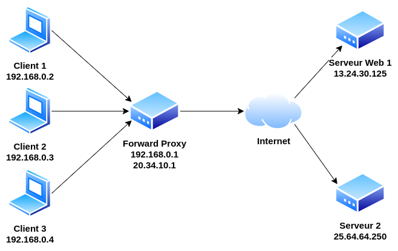
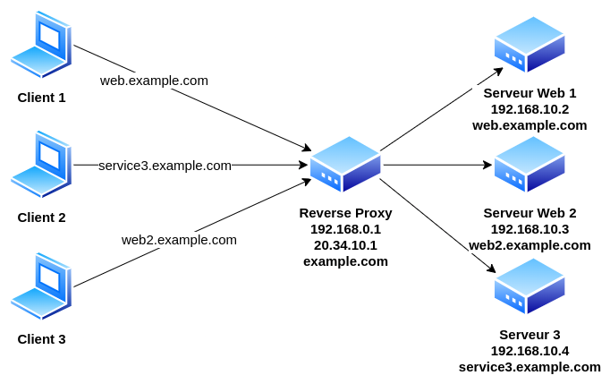
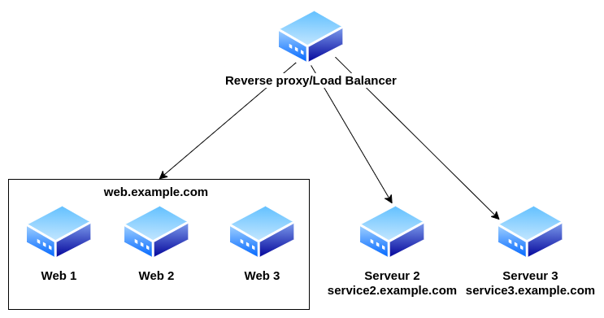

+++
pre = '<b>4. </b>'
title = 'Proxy et équilibreurs de charge'
draft = false
weight = "400"
+++

Le maintien d'une infrastructure web fiable est un élément essentiel de toute entreprise désirant mettre à disposition leur services sur internet. Compte tenu de la quantité d'informations qui transitent entre les utilisateurs/clients et les serveurs, les entreprises doivent veiller à ce que leur infrastructure soit sûre, sécurisé et rapide. Pour atteindre ces objectifs, de nombreuses entreprises cherchent à optimiser leurs infrastructures en utilisant des proxys (*forward proxies*), des proxys inverses (*reverse proxies*) ou des répartiteurs de charge (*load balancers*).

Dans ce chapitre, nous allons explorer ces composants plus en détail afin d'aider les futures ingénieurs réseau/cloud à mieux comprendre ce que chaque technologie signifie exactement pour l'infrastructure cloud dans son ensemble. 

À la fin de ce chapitre, vous devriez avoir une compréhension de base de trois éléments importants de l'infrastructure web - les *forward proxies*, les *reverse proxiess* et les *load balancers* - et être en mesure de sélectionner les bonnes combinaisons d'outils pour vos propres projets !

### Forward proxy
Un proxy (ou *forward proxy*) agit comme un intermédiaire entre un utilisateur et internet. Il masque l'adresse IP d'un utilisateur et réachemine son trafic internet via sa propre adresse IP publique. Cela permet non seulement de rendre anonyme l'activité en ligne d'un utilisateur, mais aussi d'empêcher toute cyberattaque ou tentative de piratage de son appareil.

Chaque personne possédant un routeur/modem/box internet fournie par son fournisseur de service internet possède déjà un *forward proxy* implémenté chez lui. 

### Reverse Proxy

Alors qu'un *forward proxy* contrôle le trafic sortant d'un réseau privé, un *reverse proxy* (ou proxy inverse) dirige le trafic entrant vers le serveur approprié.

#### Avantages 
+ **Équilibrage de la charge (*Load Balancing*) -** Un site web populaire qui reçoit des millions d'utilisateurs chaque jour peut ne pas être en mesure de gérer l'ensemble de son trafic entrant avec un seul serveur. Au lieu de cela, le site peut être réparti sur un ensemble de serveurs différents, qui traitent tous les demandes pour le même site. Dans ce cas, un proxy inverse peut fournir une solution d'équilibrage de la charge qui répartira le trafic entrant de manière égale entre les différents serveurs afin d'éviter qu'un seul d'entre eux ne soit surchargé. En cas de défaillance d'un serveur, d'autres serveurs peuvent prendre le relais pour gérer le trafic.

+ **Protection contre les attaques -** Avec un proxy inverse en place, un site web ou un service n'a jamais besoin de révéler l'adresse IP de son (ses) serveur(s) d'origine. Il est donc beaucoup plus difficile pour les attaquants de tirer parti d'une attaque ciblée contre eux, telle qu'une attaque DDoS.

+ **Cryptage SSL (HTTPS) -** Un proxy inverse peut être configuré pour déchiffrer toutes les requêtes entrantes et chiffrer toutes les requêtes sortantes, en mettant en place un chiffrement des communications SSL (ou TLS) et assurer le protocole HTTPS pour tous les services et serveurs qu'il protège.

