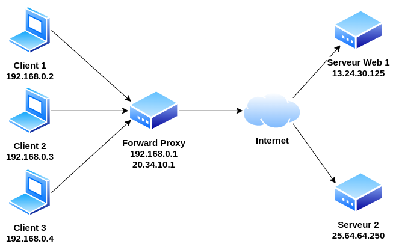
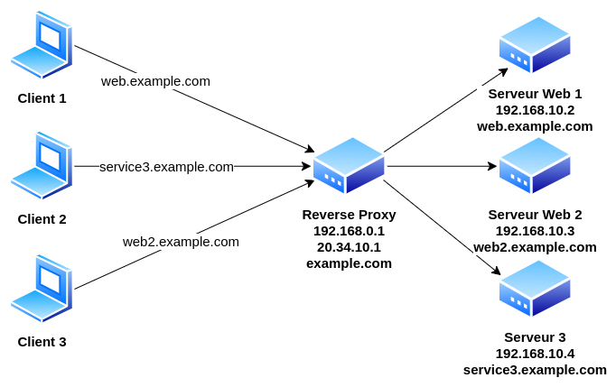
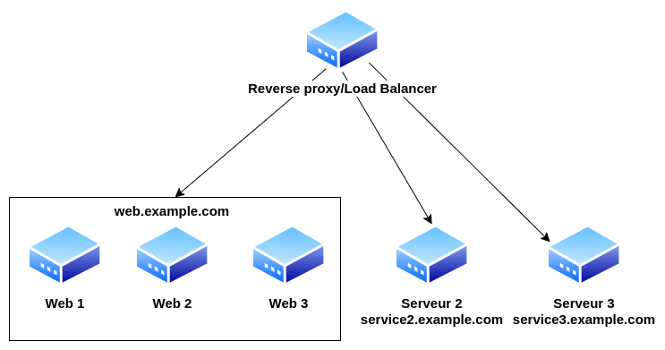

+++
pre = '<b>4. </b>'
title = 'Proxy et Load Balancer'
draft = false
weight = "400"
+++
--------------

Le maintien d’une infrastructure web fiable est essentiel pour toute entreprise souhaitant offrir ses services sur Internet. Étant donné la quantité importante de données échangées entre les utilisateurs et les serveurs, il est crucial de garantir une infrastructure sécurisée, performante et disponible.

Pour atteindre ces objectifs, les entreprises utilisent différents composants réseau tels que :

+ ***les forward proxies*** (proxys directs)
+ ***les reverse proxies*** (proxys inverses)
+ ***les load balancers*** (répartiteurs de charge)

Dans ce chapitre, nous allons explorer ces technologies afin de mieux comprendre leur rôle dans une infrastructure web moderne.

## Forward Proxy (Proxy direct)

Un proxy (ou *forward proxy*) agit comme un intermédiaire entre un utilisateur et internet. Il masque l'adresse IP d'un utilisateur et réachemine son trafic internet via sa propre adresse IP publique. Cela permet non seulement de rendre anonyme l'activité en ligne d'un utilisateur, mais aussi d'empêcher toute cyberattaque ou tentative de piratage de son appareil.

### Fonctionnement

1. L’utilisateur envoie sa requête au proxy
2. Le proxy transmet la requête vers Internet
3. Le serveur distant répond au proxy
4. Le proxy renvoie la réponse à l’utilisateur

### Rôles principaux

+ Masquer l’adresse IP de l’utilisateur
+ Contrôler l’accès à Internet (filtrage, restrictions)
+ Améliorer la sécurité du réseau interne
+ **Exemple :** Dans un réseau d’entreprise, un forward proxy peut :
  + bloquer certains sites web
  + enregistrer les accès des utilisateurs
  + protéger les machines internes

{}
+ Les routeurs/modems fournis par les fournisseurs Internet peuvent intégrer des fonctionnalités similaires à un proxy.
+ Outils permettant d'implémenter un forward proxy : *PfSense*
{}

## Reverse Proxy (Proxy inverse)
Alors qu'un *forward proxy* contrôle le trafic sortant d'un réseau privé, un *reverse proxy* (ou proxy inverse) dirige le trafic entrant vers le serveur approprié. Un reverse proxy agit du côté des serveurs. Il sert d’intermédiaire entre les utilisateurs et un ou plusieurs serveurs backend.

### Fonctionnement
1. L’utilisateur envoie une requête au serveur (via Internet)
2. Le reverse proxy reçoit la requête
3. Il redirige la requête vers le bon serveur
4. Il renvoie la réponse à l’utilisateur

### Avantages 
#### Équilibrage de charge (Load Balancing) 
Un site à fort trafic peut utiliser plusieurs serveurs. Le reverse proxy permet de :

+ répartir les requêtes entre plusieurs serveurs
+ éviter la surcharge d’un seul serveur
+ assurer une meilleure disponibilité

En cas de panne d’un serveur, les autres prennent le relais.

#### Sécurité
+ Les serveurs backend restent cachés
+ Leur adresse IP n’est pas exposée
+ Réduction des risques d’attaques (ex : DDoS)

#### Gestion du chiffrement (SSL/TLS)

Le reverse proxy peut :

+ gérer le HTTPS
+ déchiffrer les requêtes entrantes
+ chiffrer les réponses sortantes

Cela simplifie la gestion des certificats pour les serveurs internes.

## Load Balancer (Répartiteur de charge)

Un load balancer est un composant (souvent intégré au reverse proxy) qui distribue le trafic entre plusieurs serveurs. Cela permet de :

+ Améliorer la performance
+ Assurer la haute disponibilité
+ Éviter les surcharges

### Méthodes de répartition
+ **Round Robin** (tour à tour)
+ **Least Connections** (serveur le moins occupé)
+ **IP Hash** (selon l’utilisateur)