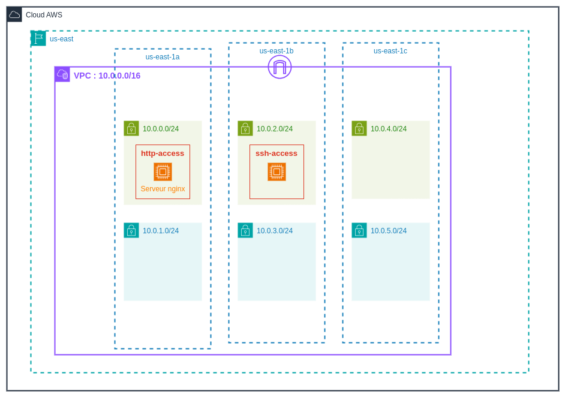

+++
title = 'Laboratoire 2'
draft = false
weight = "520"
+++

Dans ce laboratoire, nous allons mettre en place l'infrastructure du TP1 avec Terraform.

### Architecture 


#### Liste des ressources
+ **1 VPC**
    + **Plage d’adresse IPv4 :**  `10.0.0.0/16`
    + **Région :** us-east-1
+ **6 Sous-réseaux**
    + **3 sous-réseaux publics :**
        + `tp1-public-1` 
            + **CIDR :** `10.0.0.0/24`
            + **Type :** public
            + **AZ :** us-east-1a
        + `tp1-public-2` : 
            + **CIDR :** `10.0.2.0/24`
            + **Type :** public
            + **AZ :** us-east-1b
        + `tp1-public-3` : 
            + **CIDR :** `10.0.4.0/24`
            + **Type :** public
            + **AZ :** us-east-1c
    + **3 sous-réseaux privés :**
        + `tp1-private-1`
            + **CIDR :** `10.0.1.0/24`
            + **Type :** privé
            + **AZ :** us-east-1a
        + `tp1-private-2` 
            + **CIDR :** `10.0.3.0/24`
            + **Type :** privé
            + **AZ :** us-east-1b
        + `tp1-private-3` 
            + **CIDR :** `10.0.5.0/24`
            + **Type :** privé
            + **AZ :** us-east-1c
+ **2 Tables de routage**
    + `rtb-tp1-public` : table de routage pour les sous-réseaux publics
    + `rtb-tp1-private` : table de routage pour les sous-réseaux privés
+ **1 Passerelle Internet**
+ **2 Groupes de sécurité**
    + `http-access` : Autorise le trafic HTTP
    + `ssh-access` : Autorise le trafic SSH
+ **2 Instances EC2**
    + `web-server` 
        + **AMI :** *Ubuntu 24.04 LTS*
        + **Sous-réseau :** `tp1-public-1`
        + **Groupe de sécurité :** `http-access`
        + *Cette instance héberge un serveur Web Nginx*
    + `public-instance`
        + **AMI :** *Ubuntu 24.04 LTS*
        + **Sous-réseau :** `tp1-public-2`
        + **Groupe de sécurité :** `ssh-access`

#### Étape 0 - Mise en place du projet terraform

##### Pré-requis 
+ AWS CLI installé
+ Terraform installé

##### Étapes préliminaires

1. Copiez les *credentials* de votre compte AWS dans le fichier `~/.aws/credentials`
2. Créez un répertoire `tp1-terraform`
3. Entrez dans le répertoire (`cd tp1-terraform`) et créez le fichier de configuration du provider (`providers.tf`).

```hcl
terraform {
  required_providers {
    aws = {
      source  = "hashicorp/aws"
      version = "5.95.0"
    }
  }
}

provider "aws" {
  region = "us-east-1"
}
```
4. Initialisez le projet terraform :
```bash
terraform init
```

#### Étape 1 - Création du VPC

```hcl
resource "aws_vpc" "tp1" {
  cidr_block = var.vpc_cidr

  tags = {
    Name = "VPC-TP1"
  }
}

variable "vpc_cidr" {
  type        = string
  description = "Plages d'adresses du VPC"
  default     = ["10.0.0.0/16"]
}
```

#### Étape 2 - Création des sous-réseaux

```hcl
variable "public_subnet_cidrs" {
  type        = list(string)
  description = "Plages d'adresses des sous-réseaux publics"
  default     = ["10.0.0.0/24", "10.0.2.0/24", "10.0.4.0/24"]
}

variable "private_subnet_cidrs" {
  type        = list(string)
  description = "Plages d'adresses des sous-réseaux privés"
  default     = ["10.0.1.0/24", "10.0.3.0/24", "10.0.5.0/24"]
}

variable "azs" {
  type        = list(string)
  description = "Availability Zones"
  default     = ["us-east-1a", "us-east-1b", "us-east-1c"]
}
```

```hcl
resource "aws_subnet" "public_subnets" {
  count             = length(var.public_subnet_cidrs)
  vpc_id            = aws_vpc.tp1.id
  cidr_block        = element(var.public_subnet_cidrs, count.index)
  availability_zone = element(var.azs, count.index)


  tags = {
    Name = "tp1-public-${count.index + 1}"
  }
}

resource "aws_subnet" "private_subnets" {
  count             = length(var.private_subnet_cidrs)
  vpc_id            = aws_vpc.tp1.id
  cidr_block        = element(var.private_subnet_cidrs, count.index)
  availability_zone = element(var.azs, count.index)


  tags = {
    Name = "tp1-private-${count.index + 1}"
  }
}
```

#### Étape 3 - Création d'une passerelle internet

```hcl
resource "aws_internet_gateway" "gw" {
  vpc_id = aws_vpc.tp1.id

  tags = {
    Name = "tp1-igw"
  }
}
```

#### Étape 4 - Créer des tables de routage

```hcl
resource "aws_route_table" "public_rt" {
  vpc_id = aws_vpc.tp1.id

  route {
    cidr_block = "0.0.0.0/0"
    gateway_id = aws_internet_gateway.gw.id
  }
  route {
    cidr_block = "10.0.0.0/16"
    gateway_id = "local"
  }

  tags = {
    Name = "tp1-rtb-public"
  }
}

resource "aws_route_table" "private_rt" {
  vpc_id = aws_vpc.tp1.id

  route {
    cidr_block = "10.0.0.0/16"
    gateway_id = "local"
  }

  tags = {
    Name = "tp1-rtb-private"
  }
}
```
#### Étape 5 - Association sous-réseaux/tables de routage

```hcl
resource "aws_route_table_association" "public_subnet_association" {
  count          = length(var.public_subnet_cidrs)
  subnet_id      = element(aws_subnet.public_subnets[*].id, count.index)
  route_table_id = aws_route_table.public_rt.id
}

resource "aws_route_table_association" "private_subnet_association" {
  count          = length(var.public_subnet_cidrs)
  subnet_id      = element(aws_subnet.private_subnets[*].id, count.index)
  route_table_id = aws_route_table.private_rt.id
}
```

#### Étape 6 - Création des groupes de sécurité

```hcl
resource "aws_security_group" "ssh_access" {
  name        = "ssh-access"
  description = "Allow SSH inbound traffic"
  vpc_id      = aws_vpc.tp1.id

  ingress {

    description = "SSH"
    from_port   = "22"
    to_port     = "22"
    protocol    = "tcp"
    cidr_blocks = ["0.0.0.0/0"]
  }
  egress {
    from_port        = 0
    to_port          = 0
    protocol         = "-1"
    cidr_blocks      = ["0.0.0.0/0"]
    ipv6_cidr_blocks = ["::/0"]
  }
}

resource "aws_security_group" "http_access" {
  name        = "http-access"
  description = "Allow HTTP inbound traffic"
  vpc_id      = aws_vpc.tp1.id

  ingress {
    description = "HTTP"
    from_port   = "80"
    to_port     = "80"
    protocol    = "tcp"
    cidr_blocks = ["0.0.0.0/0"]
  }
  egress {
    from_port        = 0
    to_port          = 0
    protocol         = "-1"
    cidr_blocks      = ["0.0.0.0/0"]
    ipv6_cidr_blocks = ["::/0"]
  }
}
```

#### Étape 7 - Création d'une paire de clés

```hcl
resource "aws_key_pair" "tp1_key" {
  key_name   = "tp1-keypair"
  public_key = tls_private_key.rsa.public_key_openssh
}

resource "tls_private_key" "rsa" {
  algorithm = "RSA"
  rsa_bits  = 4096

}

resource "local_file" "cluster_keypair" {
  content  = tls_private_key.rsa.private_key_pem
  filename = "${path.module}/tp1-keypair.pem"
}
```

#### Étape 8 - Création des instances

```hcl
variable "ami_id" {
  type        = string
  description = "Id de l'AMI de l'instance"
  default     = "ami-084568db4383264d4"
}

variable "instance_type" {
  type        = string
  description = "Type de l'instance EC2"
  default     = "t2.micro"
}
```

```hcl
resource "aws_instance" "web_server" {
  ami           = var.ami_id
  instance_type = var.instance_type

  subnet_id                   = aws_subnet.public_subnets[0].id
  associate_public_ip_address = true
  vpc_security_group_ids      = [aws_security_group.http_access.id, aws_security_group.ssh_access.id]

  key_name = aws_key_pair.tp1_key.key_name

  tags = {
    Name = "web-server"
  }

  user_data = file("${path.module}/user-data.sh")

}

resource "aws_instance" "public_instance" {
  ami           = var.ami_id
  instance_type = var.instance_type

  subnet_id                   = aws_subnet.public_subnets[1].id
  associate_public_ip_address = true
  vpc_security_group_ids      = [aws_security_group.ssh_access.id]

  key_name = aws_key_pair.tp1_key.key_name

  tags = {
    Name = "public-instance"
  }
}
```

```hcl
output "web_server_public_ip" {
  description = "Adresse IP publique du serveur web"
  value       = try(aws_instance.web_server.public_ip, "")
}

output "public_instance_public_ip" {
  description = "Adresse IP publique de l'instance publique"
  value       = try(aws_instance.public_instance.public_ip, "")
}
```

`user-data.sh` :
```bash
#!/bin/bash

sudo apt update

sudo apt install nginx -y

sudo systemctl enable nginx

sudo systemctl start nginx
```

### Challenge
Essayez d'implémenter le TP2 !