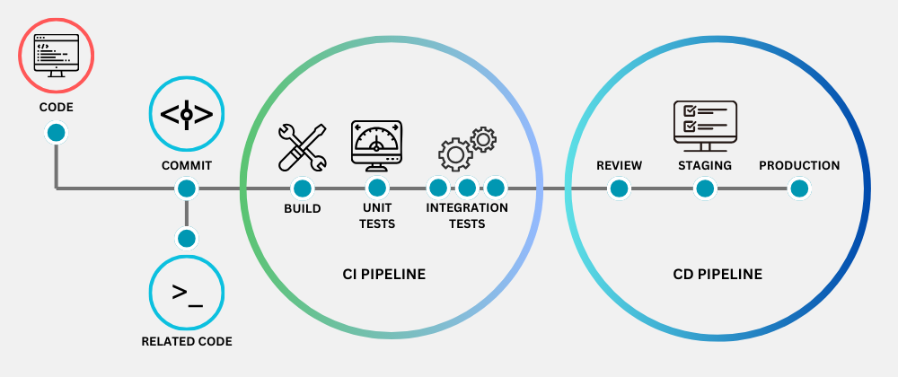
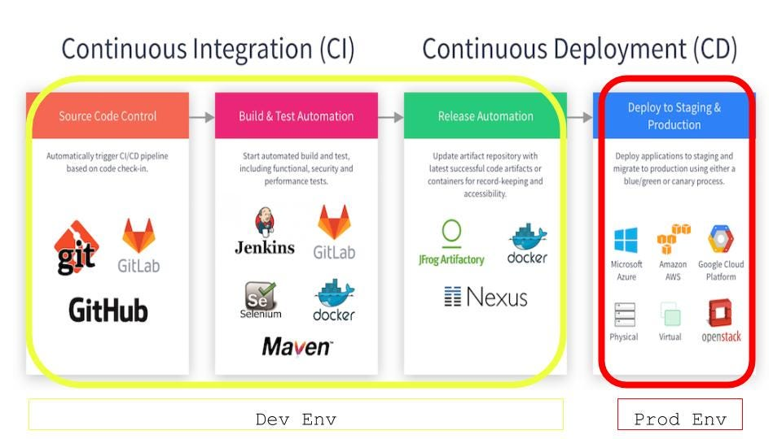
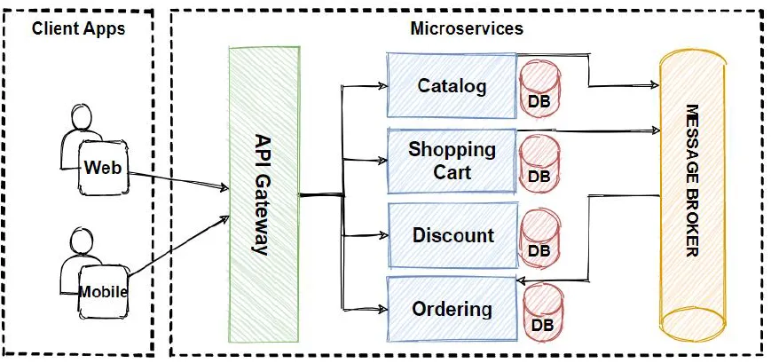

+++
pre = '<b>5. </b>'
title = 'DevOps et IaC'
draft = false
weight = "500"
+++

Le DevOps est une pratique qui vise à améliorer la collaboration entre les équipes de développement de logiciels (Dev) et les équipes chargées des opérations informatiques (Ops). Elle a pour but de *raccourcir le cycle de vie de développement des applications* et de *livrer continuellement des logiciels* de haute qualité. Les équipes DevOps *intègrent les activités opérationnelles aux outils de développement et aux validations de code*, de sorte que les applications suivent des cycles de publication rapides et efficaces.

### Pratiques DevOps

#### Intégration continue (*CI*) 
L'intégration continue (*Continuous Integration* ou *CI*) est une méthode de développement logiciel dans laquelle les développeurs intègrent régulièrement leurs modifications de code à un référentiel centralisé, suite à quoi des opérations de build et de test sont automatiquement lancés. Les principaux objectifs de l'intégration continue sont de trouver et de corriger plus rapidement les bogues, d'améliorer la qualité des logiciels et de réduire le temps nécessaire pour valider et publier de nouvelles mises à jour.

#### Déploiement continue (*CD*)
Le déploiement continu est une stratégie de développement de logiciels qui consiste à diffuser automatiquement les modifications apportées au code d'une application vers l'environnement de production. Cette pratique étend le principe de l'intégration continue en déployant tous les changements de code dans un environnement de test et/ou un environnement de production après l'étape de développement. Une bonne livraison continue permet aux développeurs de toujours disposer d'un **artéfact** prêt au déploiement après avoir suivi un processus de test normalisé.

##### Pipeline CI/CD

#### Micro-services
L'architecture de microservices est une approche de conception qui consiste à diviser une application en un ensemble de petits services, supposée pouvoir fonctionner de façon indépendante. Chaque service est exécuté par son propre processus et communique avec les autres services par le biais d'une interface bien définie et à l'aide d'un mécanisme léger, typiquement une API. Les microservices sont conçus autour de capacités métier ; chaque service est dédié à une seule fonction. Vous pouvez utiliser différents frameworks ou langages de programmation pour écrire des microservices et les déployer indépendamment, en tant que service unique ou en tant que groupe de services.

#### Infrastructure en tant que Code (*IaC*)
<!-- L'un des principaux objectifs du DevOps est d'automatiser les tâches relatives à l'infrastructure tout au long du processus de développement. Il est possible d'intégrer l'infrastructure en tant que code aux pipelines d'intégration et de déploiement continus (CI/CD). Ainsi, les modifications d'infrastructure nécessaires peuvent être effectuées parallèlement aux étapes du processus de création et de publication du logiciel.

Les équipes DevOps utilisent l'infrastructure en tant que code à de nombreuses fins :

+ Configurer rapidement des environnements complets, du développement à la production
+ Garantir la reproductibilité constante des configurations entre les environnements
+ Intégrer facilement les fournisseurs de cloud et mettre efficacement à l'échelle les ressources d'infrastructure en fonction de la demande

L'IaC met un langage commun à la disposition des développeurs comme des équipes responsables des opérations. Les modifications peuvent être examinées de manière transparente (en analysant du code) pour une meilleure collaboration dans un environnement DevOps. -->

L'infrastructure en tant que code est une pratique qui implique la mise en service et la gestion de l'infrastructure en utilisant du code et des techniques de développement de logiciels, (contrôle des versions et intégration continue) au lieu de devoir installer et configurer manuellement chaque ressource.

Tout comme le code logiciel décrit une application et son fonctionnement, **L'*IaC* décrit l'architecture d'un système et son fonctionnement.** 

Une infrastructure contient des ressources comme des serveurs, un réseau, des systèmes d'exploitation et du stockage. L'**IaC contrôle ces ressources en traitant les fichiers de configuration comme des fichiers de code source** : l'infra est gérée de manière **codifiée** et **reproductible**. 

L'*IaC* permet de définir l'état souhaité d'une infrastructure sans inclure toutes les étapes nécessaires pour l'atteindre (*approche déclarative*). 

##### Avantages 
+ **Automatisation (*Automation*):** L'infrastructure en tant que code sert à automatiser l'infrastructure en vue de créer des environnements. Traditionnellement, les administrateurs système combinaient scripts et processus manuels pour configurer les environnements d'infrastructure : un processus plus complexe et chronophage. Aujourd'hui, il est possible d'utiliser l'IaC pour configurer automatiquement un environnement en quelques minutes et le gérer plus efficacement.

+ **Duplication facile d'un environnement :** Un même environnement peut être déployé ailleurs sur un système différent en utilisant une seule *IaC*.

    **Exemple :** La succursale régionale d'une entreprise emploie l'IaC pour décrire l'ensemble de l'environnement d'entreprise de la succursale, y compris les serveurs, le réseau et les configurations personnalisées. Si l'entreprise ouvrait une nouvelle succursale régionale, elle pourrait utiliser l'IaC pour reproduire à l'identique le même environnement, mettre rapidement en réseau la succursale et la rendre vite opérationnelle. L'IaC élimine les étapes manuelles et répétitives ainsi que les listes de contrôle autrefois indispensables.

+ **Réduction des erreurs de configuration :** La configuration manuelle est sujette aux erreurs (l'erreur est humaine). L'IaC nous permet de réduire les erreurs : En cas de défaillances dues à des mises à jour du code IaC, il est possible de corriger rapidement le problème en mettant à niveau la base de code vers les derniers fichiers de configuration stables connus (**versionage d'une infrastructure comme un logiciel**). Il est également possible de restaurer des environnements utilisant des versions précédentes des fichiers de configuration d'IaC pour d'autres raisons, par exemple pour déployer d'anciennes versions des applications.

### Exemples d'outils IaC
+ Déclaratifs : 
    + *[AWS CloudFormation](https://docs.aws.amazon.com/cloudformation/)* 
    + *[Azure Resource Manager](https://learn.microsoft.com/en-us/azure/azure-resource-manager/management/overview)*
    + *[Terraform](https://developer.hashicorp.com/terraform/docs)*

+ Impératifs :
    + SDK d'AWS (boto3 en python)
    + Scripts bash (awscli)